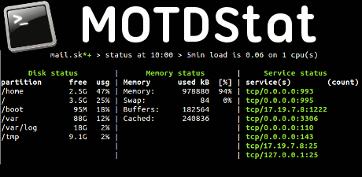

<h2 id="mcetoc_1c8pttrkm0"> MODstat for BASH 2017</h2>
<p><a href="%20https:/git.echosystem.fr/Erreur32/MOTDs32">&nbsp;https://git.echosystem.fr/Erreur32/MOTDs32</a></p>


Tags: [#BASH](https://echosystem.fr/search/query:Bash)  
     
[TOC]

!!! Ce projet <a href="https://git.echosystem.fr/Erreur32/MOTDs32.git">MOTDs32</a> est un <strong>fork</strong>&nbsp; de l'excelent <a href="https://bitbucket.org/hetii/motdstat">MODstat</a>

### Un peu d'histoire

<p>J'avais mis en place un syst&egrave;me compl&eacute;mentaire &agrave; <a href="https://bitbucket.org/hetii/motdstat">MODstat</a>, mais cela fesait doublon lors de la connexion SSH.</p>
<p>Le dernier push (datant de <mark>2015</mark>) de <a href="https://bitbucket.org/hetii/motdstat">MODstat</a> ne me plait pas du tout, </p>
<p>  Un ajout d'une banner un peu trop kikoulol (<span style="text-decoration: line-through;">laissant apparaitre un &acirc;ne...</span>) avec le script  Fortune (<span style="text-decoration: line-through;"> proverbe</span> ), est dans les tuyaux en mode push</p>
<p>pour cela j'ai décidé de  <a href="https:/git.echosystem.fr/Erreur32/MOTDs32">Fork</a>&nbsp; MOTDstat !</p>
<p>&nbsp;</p>

### Ca sert &agrave; quoi ?
<p>Avoir des jolies stats (&agrave; jours) &agrave; chaque connexion dans votre terminal, comme ceci :</p>
<p>&nbsp;</p>


Ok let's go

## **MOTDs32** = MOTD + Stats32

```
,--.   ,--. ,-----. ,--------.,------.         ,----.  ,---.
|   `.'   |'  .-.  ''--.  .--'|  .-.  \  ,---. '.-.  |'.-.  \
|  |'.'|  ||  | |  |   |  |   |  |  \  :(  .-'   .' ;  .-' .'
|  |   |  |'  '-'  '   |  |   |  '--'  /.-'  `)/'-'  |/   '-.
`--'   `--' `-----'    `--'   `-------' `----' `----' '-----'

          |  +	Ｓｔａｔｓ３２   |
                                             by  🅴🆁🆁🅴🆄🆁32
                                             
        https://git.echosystem.fr/Erreur32/MOTDs32                                                 
          
```   

**Show "Message Of The Day" in Unix terminal.    **    

 

 [What it is?](#what-it-is) | [Requirements](#requirements) | [Installation](#installation) | [Uninstall](#uninstall) | [Documentation](#documentation) | [Sample Report](#sample-motd32-report) | [Stats git Repo](#stats-repo) | [License](#license) 
---------------|---------------------|------------------|-----------------|-----------------|-------------------------|----------------------|----------------------

--------------------------------------------------

### What it is?
----------

MOTDs32 is a fork of the excelent MOTDstat ! [Original project modstat](http://www.gelogic.net/)

*Usage: generate dynamicaly the /etc/motd file with current information about system resources and usage 
The original message of the day is now stored in /etc/motd.orig file.
Everytime you connect throught the SSH you will see some informations (customisable).*


 - It's only for a g33k or adminsys for check some services status in the shell.
 
 - Add a beautifull MOTD for shell bash, each ssh connection and also with bash command. 

### Requirements
------------
- SHELL    >= bash: 4.3.30(1)
- figlet (*install auto in install.sh*)
- build-essential (package for build) (*install auto in install.sh*)
- Postfix  
  

### Installation 

```bash
 $ git clone https://git.echosystem.fr/Erreur32/MOTDs32.git
 $ cd MOTDs32
 $ /install.sh
    -->   Answer: y and enter (install the package if needed)  
    -->   see option 3 for uninstall
 
 ```
<em> Voil&agrave; , Termin&eacute; !!</em>

### Demo installation

[](https://echosystem.fr/MOTDs32/player/)


<p>Configuration file is:</p>
```
 nano    /etc/motds32/motds32.conf
```

(See [install](https://git.echosystem.fr/Erreur32/MOTDs32/src/master/INSTALL)  file.)
  
!! You can set differents features in   `/etc/motds32/motds32.conf`


### Update
-------

You Need to redownload (git pull) the lastest version from [GIT](https://git.echosystem.fr/Erreur32/MOTDs32.git).

do the following:

```bash
$ git clone https://git.echosystem.fr/Erreur32/MOTDs32.git
$ cd MOTDs32
$ ./install.sh (option 3)
$ git pull
$ ./install.sh
```
 

### Uninstall
-----------

Choose **option 3** with `./install.sh` script !


## Documentation
-------------

in your shell bash type: **motd**

```bash
$  motd
Usage: motds32 OPTIONS
    -g, --generate    Check system status and generate it to /etc/motd file
    -s, --status      Show limited content of MOTD file
    -v, --version     Display information about motds32 version and author
    -m, --MotD32      See the MOTD file
```

Result with **CAT**:
```bash
$  cat /etc/motd
```

Result with **motds32**:
```bash
$  /usr/bin/motds32
```

--------------------------------------------------
 
### Sample MOTD32 Report
--------------------


```bash
$ motd -m
Read motds32 file
        echosystem.fr  > status at 10:05 > 5min load is 0.82 on 8 cpu(s)

      Disk status        |      Memory status       |     Service status
partition      free  usg | Memory      used kB  [%] | service(s)        (count)
/              4,9G  74% | Memory:    59711808  90% | tcp/0.0.0.0:2222
/home          1,5T  12% | Swap:          3560   0% | tcp6/:::2222
                         | Buffers:    1271192      | tcp/0.0.0.0:25
                         | Cached:    51624824      | tcp6/:::25
                         |                          | tcp/127.0.0.1:8080
                         |                          | tcp6/:::80
                         |                          | tcp6/:::443
                         |                          | udp/37.187.162.229:123
                         |                          | udp/127.0.0.1:123
                         |                          | udp/0.0.0.0:123
                         |                          | udp6/fe80::ec4:7aff:fe0f:123
                         |                          | udp6/2001:41d0:d:2e5:::123
                         |                          | udp6/::1:123
             __                             __                      ___
.-----.----.|  |--.-----.-----.--.--.-----.|  |_.-----.--------.  .'  _|.----.
|  -__|  __||     |  _  |__ --|  |  |__ --||   _|  -__|        |__|   _||   _|
|_____|____||__|__|_____|_____|___  |_____||____|_____|__|__|__|__|__|  |__|
                              |_____|
/bin/bash : root

 10:05:39 up 66 days, 15:35,  2 users,  load average: 1,40, 0,79, 0,67
USER     TTY      FROM             LOGIN@   IDLE   JCPU   PCPU WHAT
erreur32 pts/0    143.173.370.24   mar.15    2days  1.62s  0.26s sshd: erreur32 [priv]
erreur32 pts/1    2a01:e45:8ad3:7 08:57    4.00s  1.10s  0.01s sshd: erreur32 [priv]

Debian GNU/Linux 8.8 (jessie) (3.16.0-4-amd64).
Kernel Info:    Linux 3.16.0-4-amd64 x86_64

-----------     ---     ------------    ----------
System load :   1.40    IP Address:     55.147.132.243
Memory usage:   10.3%   System uptime:  66 days
Usage on /  :   74%     Swap usage:     0.0%
Local Users :   2       Processes:      282
-----------     ---     ------------    ----------

  vendredi 21 juillet 2017, 10:05:39 (UTC+0200)
```

### Explanation of the report
-----

```bash
   system hostname              report time        system load
         |                          |                   |
         |      NTP status          |                   |  Number of CPU(s)
         |         |                |                   |      |
         V         V                V                   V      V                  
    echosystem.fr+-+  > status at 00:03 > 5min load is 0.75 on 8 cpu(s)</code></pre>
    
```

--------------------------------------------------
 

## My  Statistic Git

  [https://echosystem.fr/MOTDs32](https://echosystem.fr/MOTDs32)

<hr/>

**The MIT License (MIT)**

[](http://creativecommons.org/publicdomain/zero/1.0/)

Copyright (c) 2016 @echosystem.fr

Permission is hereby granted, free of charge, to any person obtaining a copy of this software and associated documentation files (the "Software"), to deal in the Software without restriction, including without limitation the rights to use, copy, modify, merge, publish, distribute, sublicense, and/or sell copies of the Software, and to permit persons to whom the Software is furnished to do so, subject to the following conditions:

The above copyright notice and this permission notice shall be included in all copies or substantial portions of the Software.

THE SOFTWARE IS PROVIDED "AS IS", WITHOUT WARRANTY OF ANY KIND, EXPRESS OR IMPLIED, INCLUDING BUT NOT LIMITED TO THE WARRANTIES OF MERCHANTABILITY, FITNESS FOR A PARTICULAR PURPOSE AND NONINFRINGEMENT. IN NO EVENT SHALL THE AUTHORS OR COPYRIGHT HOLDERS BE LIABLE FOR ANY CLAIM, DAMAGES OR OTHER LIABILITY, WHETHER IN AN ACTION OF CONTRACT, TORT OR OTHERWISE, ARISING FROM, OUT OF OR IN CONNECTION WITH THE SOFTWARE OR THE USE OR OTHER DEALINGS IN THE SOFTWARE.
 
<hr/>
<center>
<div class="row">
<div class="4u 12u$(mobile)">

<br><a href="https://echosystem.fr/my-projects">My Projects</a>
</div>
</div>
<p><br> 🆓🅴🅲🅷🅾️🆂🆈🆂🆃🅴🅼</p>
</center>

  🄴🄲🄷🄾🅂🅈🅂🅃🄴🄼
  