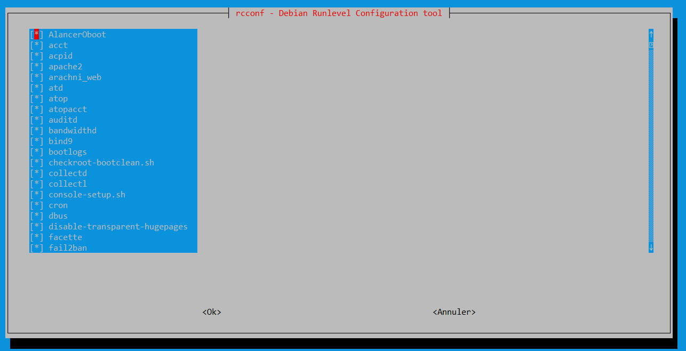
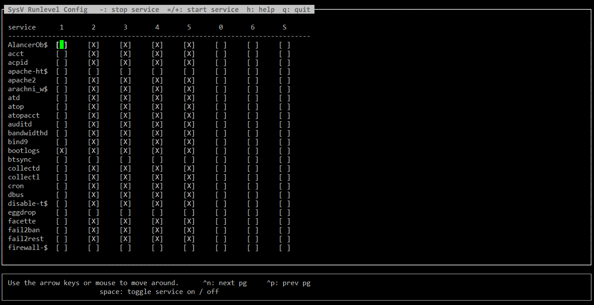

## Check des services Debian avec rcconf

Avec **rcconf ** vous avez la possibilité de vérifier facilement vos services au démarrage.
 
### installation rcconf

```
$ apt install rcconf
```

On lance rcconf:

```
$ rcconf
```

**Désavantage**: rcconf  ne peut pas gérer les runlevels. 
 Voir  sysv-rc-conf pour cela.

**Avantage** Simplicité d'utilisation , très bien pour de faire une idée des services lancer au démarrage.
 


# Alternative
## sysv-rc-conf

**sysv-rc-conf** va un peu plus loin que  **rcconf** .
Il affiche les runlevels de démarrage et d’arrêt, de 0 à 6.
Il peut aussi arrêter/démarrer un service à la _volée_ comme le fait la commande service.

Installation :
```
$ apt install sysv-rc-conf
```

Lancer le service :
```
$ sysv-rc-conf
```
(Possibilité d’activer/désactiver chaque runlevel de chaque service.)

sysv-rc-conf permet également de lister tous les services et leurs runlevels.



```
$ sysv-rc-conf --list
```

Exemple:

```
$ sysv-rc-conf --list
AlancerOboot 0:off      2:on    3:on    4:on    5:on    6:off
acct         0:off      1:off   2:on    3:on    4:on    5:on    6:off
acpid        2:on       3:on    4:on    5:on
apache-htcac 0:off      1:off   2:off   3:off   4:off   5:off   6:off
apache2      0:off      1:off   2:on    3:on    4:on    5:on    6:off
atd          0:off      1:off   2:on    3:on    4:on    5:on    6:off
atop         0:off      1:off   2:on    3:on    4:on    5:on    6:off
atopacct     0:off      1:off   2:on    3:on    4:on    5:on    6:off
auditd       0:off      1:off   2:on    3:on    4:on    5:on    6:off
bandwidthd   0:off      1:off   2:on    3:on    4:on    5:on    6:off
collectd     0:off      1:off   2:on    3:on    4:on    5:on    6:off
collectl     0:off      1:off   2:on    3:on    4:on    5:on    6:off
cron         2:on       3:on    4:on    5:on
dbus         2:on       3:on    4:on    5:on
disable-tran 0:off      1:off   2:on    3:on    4:on    5:on    6:off
fail2ban     0:off      1:off   2:on    3:on    4:on    5:on    6:off
 
````