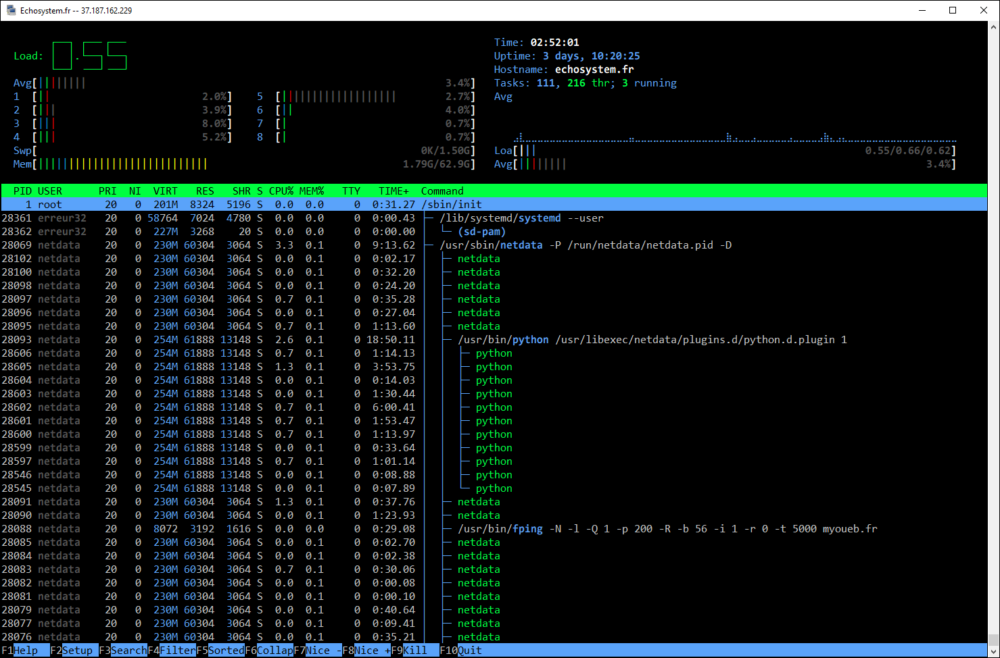

###  Installtion via apt-get :

```bash
$ apt-get install htop
```

####  TIPS:

 - Changer le style d’affichage **LED Bar Text ou Graph**  , appuyer sur la barre d’espace clavier une fois sur l’élément choisi. !
 
 - Require:  [librairie Ncurses 6 ](https://www.gnu.org/software/ncurses/)
```bash
$ apt-get  install libncurses5-dev libncursesw5-dev 
```