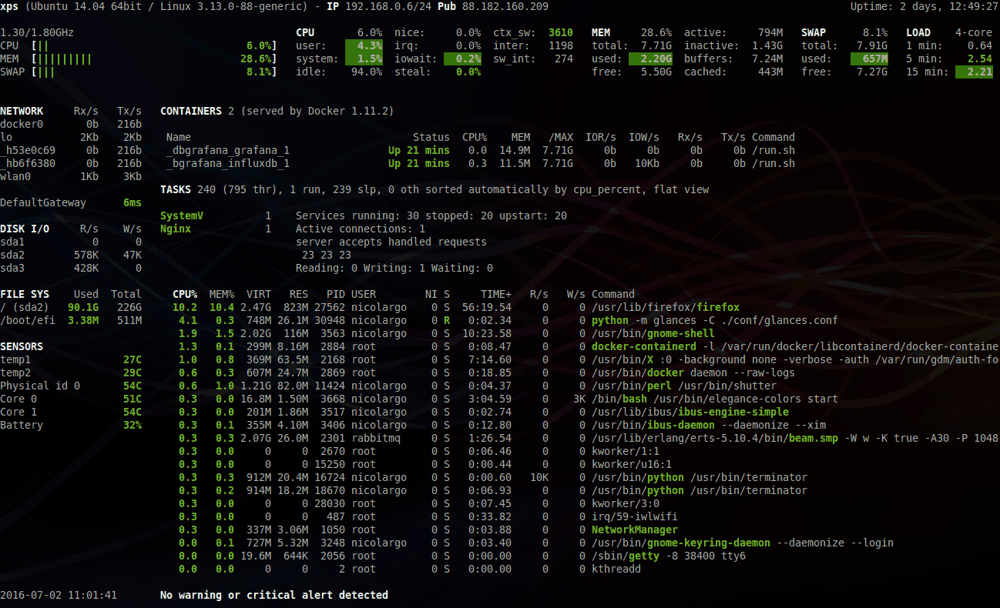

Glances Auto Install script


To **install the latest Glances production** ready version, just enter the following command line:

```bash
$ curl -L https://bit.ly/glances | /bin/bash
```
or

```bash
$ wget -O- https://bit.ly/glances | /bin/bash
```

Note: **Only supported on some GNU/Linux distributions**.


Glances is on **PyPI**. By using PyPI, you are sure to have the latest stable version.

To **install**, simply use **pip**:

```bash
$ pip install glances
```

Others methods ? Read the [official installation documentation.](https://github.com/nicolargo/glances/blob/master/README.rst)
