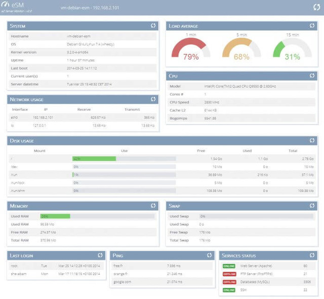
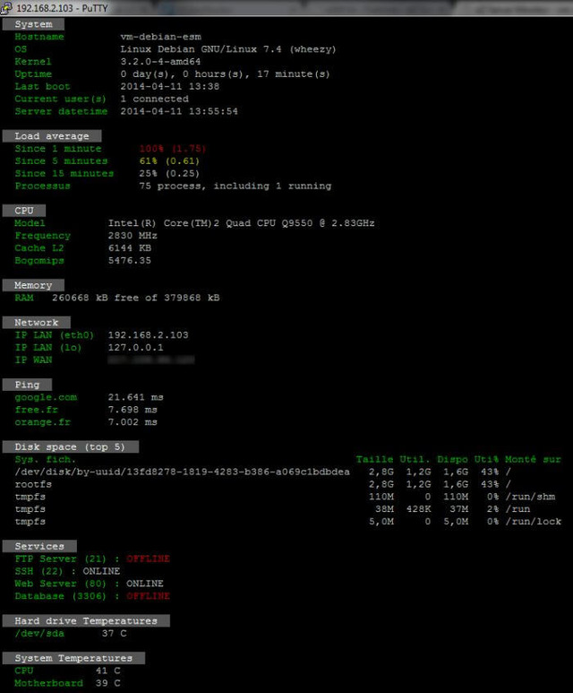

#### eZ Server Monitor `Web

Version Web, eZ Server Monitor est un script PHP:

#### eZ Server Monitor `sh

Version Bash (eSM`sh),  pour terminal Unix.

Link project: [http://www.ezservermonitor.com/esm-web/downloads](http://www.ezservermonitor.com/esm-web/downloads)

**Installation:**
> **PHP** - [https://github.com/shevabam/ezservermonitor-web](https://github.com/shevabam/ezservermonitor-web)

> **SH**   -  [https://github.com/shevabam/ezservermonitor-sh](https://github.com/shevabam/ezservermonitor-sh)