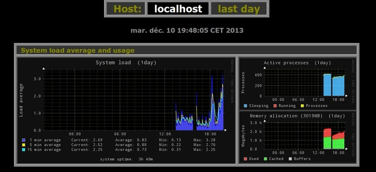

 
#### Installation Monitorix

**Via the repository**

    # apt-get update
    # apt-get install monitorix
             

**Manually**

downloading first the package and taking care for dependencies, and finally installing it.

    # apt-get update
    # apt-get install rrdtool perl libwww-perl libmailtools-perl libmime-lite-perl \
    librrds-perl libdbi-perl libxml-simple-perl libhttp-server-simple-perl \ 
    libconfig-general-perl libio-socket-ssl-perl
    # dpkg -i monitorix*.deb
    # apt-get -f install
    	 

#### Configuring Monitorix
Monitorix ships with a default configuration file which works out-of-the-box. Moreover, the service is automatically started on package installation.

To fine-tune your installation, take a look at the /etc/monitorix/monitorix.conf file (and optionally the documentation) to adjust some things (like network interfaces, filesystems, disks, etc.).

IMPORTANT NOTICE:
  The Debian package also comes with an extra configuration file in /etc/monitorix/conf.d/00-debian.conf that includes some options specially adapted for Debian systems. 
  This file will be loaded right after the main configuration file, hence some options in the main configuration will be overwritten by this extra file.

When you are done, restart Monitorix to let your changes take effect:

    service monitorix restart
      
Link official : [http://www.monitorix.org](http://www.monitorix.org)

Enjoy!