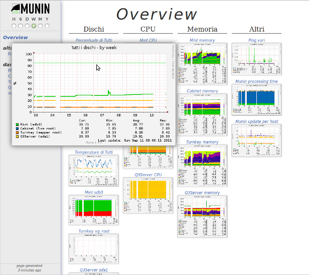

###   Installing Munin
  
You will need to install "munin-master" on the machine that will
collect data from all nodes, and graph the results. When starting with
Munin, it should be enough to install the Munin master on one server.

The munin master runs :ref:`munin-httpd` which is a basic webserver
which provides the munin web interface on port 4948/tcp.

<div class="notices yellow">
Install "munin-node" on the machines that shall be monitored by Munin.
Install "munin-client" on the machines that have web poge monitoring.
</div>

### Source or packages?


With open source software, you can choose to install binary packages
or install from source-code.

<div class="notices red">

	We `strongly` recommend a packaged install, as the source distribution
	isn't as tested as the packaged one. The current state of the packages
	is so satisfactory, that even the developers use them instead.
</div>

Installing Munin on most relevant operating systems can usually be
done with the systems package manager, typical examples being:

### Installing Munin from a package
 

 
### Debian/Ubuntu
 

Munin is distributed with both Debian and Ubuntu.

In order to get Munin up and running type

```bash
 $ sudo apt-get install munin-node
```

on all nodes, and

```bash
 $ sudo apt-get install munin
```

on the master.

Please note that this might not be the latest version of Munin. On
Debian you have the option of enabling "backports", which may give
access to later versions of Munin.
 
 Link Project: [http://munin-monitoring.org/](http://munin-monitoring.org/)