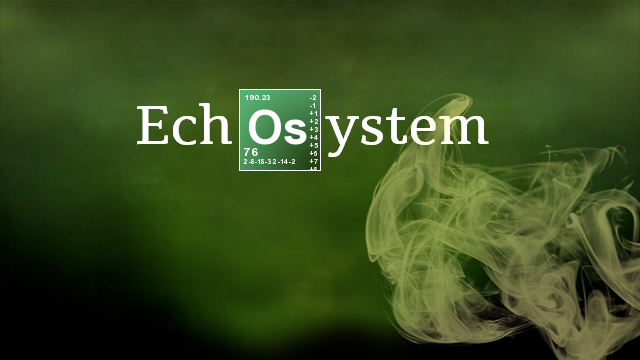

[ui-callout]
[ui-callout-item title="Outlines" position="15%, 20%, se"]
This administrative panel lists displays the current theme's outlines, giving you quick access 
to edit, rename, duplicate, and delete them.
[/ui-callout-item]
[ui-callout-item title="Menu Editor" position="60%, 85%, nw"]
This administrative [color=blue]panel gives you the ability[/color] to enhance the platform's 
menu by altering styling, rearranging links, and creating menu items that sit outside of the 
CMS's integrated Menu Manager.
[/ui-callout-item]

[/ui-callout]

<pre>[assets=inlineCss] h4 {color: blue !important;} [/assets]</pre>
<h4> h4 color blue</h4>
<pre> <strong>Preformatted ON</strong></pre>

[assets=inlineCss] h4 {color: green !important;} [/assets]

<h4>h4 color test green</h4>

 <strong>Preformatted Off</strong>

 test affichage code :

   <code>[assets=inlineCss] h4 {color: blue !important;} [/assets]</code> <code>[assets=inlineCss] h4 {color: blue !important;} [/assets]</code> <code>[assets=inlineCss] h4 {color: blue !important;} [/assets]</code>    

<h1 id="mcetoc_1c91dbtpc0">TEST BBCODE</h1>

shortcodes&nbsp; &nbsp; &nbsp;&nbsp; &nbsp; ON&nbsp; 

shortcodes-ui &nbsp;&nbsp;&nbsp; ON&nbsp; &nbsp;

&nbsp;

[i][b]!Caution![/b][/i] This plugin [b]RAW[/b] output from file. Please check Broken HTML tags and Security risk before upload.&nbsp;<header>
<blockquote>
<h3 id="mcetoc_1c8uqjsie6">echosystem.fr</h3>
</blockquote>
</header>
<blockquote>[url=https://erreur32.echosystem.fr/][img]../../Screenshot/?url=echosystem.info/index.php?r=dashboard/dashboard&amp;clipw=1000&amp;cliph=750&amp;cache=0[/img][/url]</blockquote>

<header>
<h3 id="mcetoc_1c8uqjsiea">Avatar</h3>
</header>
<pre class="4u$ 12u$(mobile)">[url=https://erreur32.echosystem.fr/][img]https://upfile.echosystem.fr/plugins/imageviewer/site/direct.php?s=wf&amp;/erreur.png[/img][/url]</pre>

&nbsp;

#################

&nbsp;File source

<h1 id="mcetoc_1c9081miu0">&nbsp;ON&nbsp; </h1>

The plugin is to be called from a page Markdown source file (eg. <code>item.md</code>).

<h3 id="mcetoc_1c9089p481">SYNOPSIS</h3>
<pre><code>[plugin:filesource](*filename*)
</code></pre>
<h3 id="mcetoc_1c9089p482">OPTIONS</h3>

<em>filename</em> is the name of the file to be embedded into the page. <em>filename</em> must reside in the same directory as the page source file.

<h3 id="mcetoc_1c9089p483">NOTES</h3>

<strong>filesource</strong> can be used to embed <em>any</em> file to a page as text and it <em>won't</em> check the file content type or encoding. Embedding binary or other non-text files may have unexpected results.

<h1 id="mcetoc_1c907pai00">File Content</h1>
<h1 id="mcetoc_1c9081miu0">&nbsp;ON&nbsp;  </h1>

&nbsp;

This plugin provides both a Twig <strong>filter</strong> and <strong>function</strong>. To use them simply use the following syntax:

<pre><code>{{ filecontent('sample.txt') }}

or

{{ 'sample.txt'|filecontent }}

or 

{{ filecontent('/user/custom/sample.txt') }}    </code></pre>

<pre><code>
</code></pre>
<h1 id="mcetoc_1c8vnu3vq0">Mini Code <small>v1.1.0&nbsp;  </small></h1>
<h1 id="mcetoc_1c9081miu0">&nbsp;ON&nbsp; </h1>

<code>Minicode</code> is [url=https://getgrav.org/]Grav[/url] plugin.

<pre>This plugin add Twig filter <code>{ { | minicode } }</code>. The filter is output tiny html (or other text) inside a document from text file.</pre>
And the filter can use on Templates too. You can output codes of site global. (ex: Sidebars, Ads, New product information...)
<h2 id="mcetoc_1c8vookmg1">Installation</h2>
Installing <code>Minicode</code> plugin can only manual install now. [url=https://github.com/gracix/grav-plugin-minicode/archive/master.zip]Download[/url] this plugin and extracting all plugin files to
<pre><code>user/plugins/minicode
</code></pre>
<h2 id="mcetoc_1c8vookmg2">Usage</h2>
<pre><code>{{ 'filename.txt' |  minicode  }}
</code></pre>
<ol>
<ol>
<ol>
<ol>
<li>Create directory user/minicodes if nothing. (This name is default. You can change directory name in plugin's config)</li>
</ol>
</ol>
</ol>
</ol>
<ol>
<ol>
<ol>
<ol>
<li>Write a tiny html (or other text) to file. (ex: minicode1.html)</li>
</ol>
</ol>
</ol>
</ol>
<ol>
<ol>
<ol>
<ol>
<li>The file put into user/minicodes directory. (ex: user/minicodes/minicode1.html)</li>
</ol>
</ol>
</ol>
</ol>
<ol>
<ol>
<ol>
<ol>
<li>Write twig tag in page content or theme file. (ex: <code>{{ 'minicode1.html' | minicode }}</code>)</li>
</ol>
</ol>
</ol>
</ol>
<ol>
<ol>
<ol>
<ol>
<li>Preview the site.</li>
</ol>
</ol>
</ol>
</ol>
<h2 id="mcetoc_1c8vookmg3">Security</h2>
[i][b]!Caution![/b][/i] This plugin [b]RAW[/b] output from file. Please check Broken HTML tags and Security risk before upload.

&nbsp;

<h2 id="mcetoc_1c91nu36e1">######################</h2>

&nbsp;

<pre>&lt;p&gt;&lt;em&gt;&minus;&lt;sup&gt;b&lt;/sup&gt;&frasl;&lt;sub&gt;R&lt;/sub&gt; &theta;' cos&lt;sup&gt;2&lt;/sup&gt; &theta; &minus; m x'' cos &theta; &minus; m R &theta;'' cos&lt;sup&gt;2&lt;/sup&gt;&theta; + m R &theta;' &lt;sup&gt;2&lt;/sup&gt;sin &theta; cos &theta; &minus; m g sin &theta; &minus; &lt;sup&gt;b&lt;/sup&gt;&frasl;&lt;sub&gt;R&lt;/sub&gt; &theta;' sin&lt;sup&gt;2&lt;/sup&gt; &theta; = m R &theta;'' sin&lt;sup&gt;2&lt;/sup&gt;&theta; + m R &theta;' &lt;sup&gt;2&lt;/sup&gt;sin &theta; cos &theta;&lt;/em&gt;&lt;/p&gt;
				</pre>
<pre>&lt;p&gt;&lt;em&gt;&amp;minus;&lt;sup&gt;b&lt;/sup&gt;&amp;frasl;&lt;sub&gt;R&lt;/sub&gt; &amp;theta;' cos&lt;sup&gt;2&lt;/sup&gt; &amp;theta; &amp;minus; m x'' cos &amp;theta; &amp;minus; m R &amp;theta;'' cos&lt;sup&gt;2&lt;/sup&gt;&amp;theta; + m R &amp;theta;' &lt;sup&gt;2&lt;/sup&gt;sin &amp;theta; cos &amp;theta; &amp;minus; m g sin &amp;theta; &amp;minus; &lt;sup&gt;b&lt;/sup&gt;&amp;frasl;&lt;sub&gt;R&lt;/sub&gt; &amp;theta;' sin&lt;sup&gt;2&lt;/sup&gt; &amp;theta; = m R &amp;theta;'' sin&lt;sup&gt;2&lt;/sup&gt;&amp;theta; + m R &amp;theta;' &lt;sup&gt;2&lt;/sup&gt;sin &amp;theta; cos &amp;theta;&lt;br /&gt;&lt;/em&gt;&lt;/p&gt;</pre>