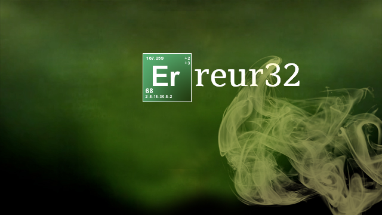

 [https://echosystem.fr/rssall/rss-light-10.php](https://echosystem.fr/rssall/rss-light-10.php)
 
 
### Feed name: {{ name }}
<small>Retrieved title: <a href="{{ feed.source }}">{{ feed.title }}</a>, {{ feed.amount }} item(s)</small>

#### <a href="{{ item.url }}">{{ item.title }}</a>

{{ item.content }}




 [ui-polaroid angle="-3" margin="30px 50px 20px 0" position="right" title="Erreur32"][ui-callout][/ui-callout][/ui-polaroid]

       { { feedus_rss() } }
 {{ feedus_rss() }}
 
      injectphp:https://echosystem.fr/rssall/rss-light-10.php
 

injectphp:https://echosystem.fr/rssall/rss-light-10.php

